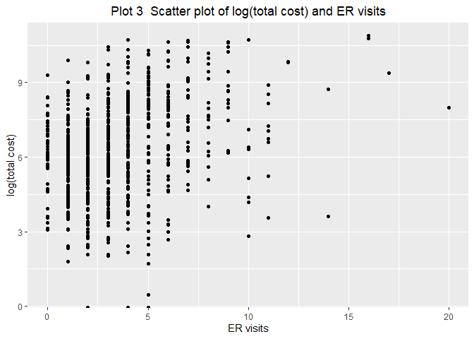

p8130\_hw4\_rq2166
================
Ruoyuan Qian
2019/11/12

# Problem 3

``` r
brain = read_excel("data\\Brain.xlsx") %>% 
   janitor::clean_names()
```

    ## Warning in FUN(X[[i]], ...): strings not representable in native encoding
    ## will be translated to UTF-8

## a)

``` r
brain_non = 
  brain %>% 
  filter(!(species == "Homo sapiens"))

fit = lm(glia_neuron_ratio ~ ln_brain_mass,brain_non) 
summary(fit)
```

    ## 
    ## Call:
    ## lm(formula = glia_neuron_ratio ~ ln_brain_mass, data = brain_non)
    ## 
    ## Residuals:
    ##      Min       1Q   Median       3Q      Max 
    ## -0.24150 -0.12030 -0.01787  0.15940  0.25563 
    ## 
    ## Coefficients:
    ##               Estimate Std. Error t value Pr(>|t|)    
    ## (Intercept)    0.16370    0.15987   1.024 0.322093    
    ## ln_brain_mass  0.18113    0.03604   5.026 0.000151 ***
    ## ---
    ## Signif. codes:  0 '***' 0.001 '**' 0.01 '*' 0.05 '.' 0.1 ' ' 1
    ## 
    ## Residual standard error: 0.1699 on 15 degrees of freedom
    ## Multiple R-squared:  0.6274, Adjusted R-squared:  0.6025 
    ## F-statistic: 25.26 on 1 and 15 DF,  p-value: 0.0001507

Calculate by hand

``` r
x_bar = mean(brain_non$ln_brain_mass)
y_bar = mean(brain_non$glia_neuron_ratio)

sum_x = sum(brain_non$ln_brain_mass)
sum_y = sum(brain_non$glia_neuron_ratio)

n = length(brain_non$ln_brain_mass)


sum_x_y = sum((brain_non$ln_brain_mass-x_bar)*
                (brain_non$glia_neuron_ratio-y_bar))
sum_x_2 = sum((brain_non$ln_brain_mass-x_bar)^2)

b1 = sum_x_y/sum_x_2

b0 = y_bar - b1*x_bar
```

## b)

``` r
coef = summary(fit)$coefficients[2,1]
err  = summary(fit)$coefficients[1,1]

ln_brain_mass_human = 
  brain %>% 
  filter(species == "Homo sapiens") %>% 
  pull(ln_brain_mass)


glia_human = coef*ln_brain_mass_human + err
```

Calculate by hand

``` r
b1_round = round(sum_x_y/sum_x_2,5)
b0_round = round(y_bar - b1*x_bar,5)

glia_human_diy = b0_round + ln_brain_mass_human*b1_round
```

## c)

using PI

## d)

``` r
brain_human = 
  brain %>% 
  filter(species == "Homo sapiens")

pred_fit <- predict.lm(fit, interval="prediction") 
```

    ## Warning in predict.lm(fit, interval = "prediction"): predictions on current data refer to _future_ responses

``` r
PI_all <- data.frame(cbind(brain$ln_brain_mass,
                           brain$glia_neuron_ratio,
                           pred_fit)) %>% 
                      filter(V1 == 7.22)
```

    ## Warning in cbind(brain$ln_brain_mass, brain$glia_neuron_ratio, pred_fit):
    ## number of rows of result is not a multiple of vector length (arg 1)

``` r
PI_all
```

    ##     V1   V2      fit     lwr      upr
    ## 1 7.22 1.65 1.217875 0.82715 1.608601

``` r
human_PI_lwr = PI_all[[1,4]]
human_PI_upr = PI_all[[1,5]]


human_PI_upr > brain_human$glia_neuron_ratio
```

    ## [1] FALSE

Calculate by hand

``` r
x_bar = mean(brain_non$ln_brain_mass)
y_bar = mean(brain_non$glia_neuron_ratio)

sum_x = sum(brain_non$ln_brain_mass)
sum_y = sum(brain_non$glia_neuron_ratio)

n = length(brain_non$ln_brain_mass)


sum_x_y = sum((brain_non$ln_brain_mass-x_bar)*
                (brain_non$glia_neuron_ratio-y_bar))
sum_x_2 = sum((brain_non$ln_brain_mass-x_bar)^2)

b1 = sum_x_y/sum_x_2

b0 = y_bar - b1*x_bar

sum_y_2 = sum((brain_non$glia_neuron_ratio-y_bar)^2)

glia_original = 
  brain_non %>% 
  pull(glia_neuron_ratio)

y_hat = coef*glia_original + err

MSE = sum((glia_original-y_hat)^2)/(n-2)

se = sqrt(MSE*(1/n+((ln_brain_mass_human-x_bar)^2/sum_x_2)+1))
 sqrt(MSE*(1/n+((ln_brain_mass_human-x_bar)^2/sum_x_2)))
```

    ## [1] 0.4571858

``` r
glia_human + qt(0.975,n-2) * se
```

    ## [1] 3.225466

``` r
MSE = 0.1699^2
```

Yes, the upper bound of prediction for glia\_neuron\_ratio of human is
smaller than the observed value, which means the human brain has
excessive glia\_neuron\_ratio than other specise.

## e)

Compared to data of other species, human data is considered to be an
outlier and would affect the regression if it was used to fit the model.

# Problem 4

``` r
heart = read_csv("data\\HeartDisease.csv") %>% 
   janitor::clean_names() %>% 
  mutate(gender = factor(gender,level=c(0:1),
                         labels = c("female","male")))
```

    ## Parsed with column specification:
    ## cols(
    ##   id = col_double(),
    ##   totalcost = col_double(),
    ##   age = col_double(),
    ##   gender = col_double(),
    ##   interventions = col_double(),
    ##   drugs = col_double(),
    ##   ERvisits = col_double(),
    ##   complications = col_double(),
    ##   comorbidities = col_double(),
    ##   duration = col_double()
    ## )

## a)

**Description**:

The dataset is collected by an insurance company about the total cost of
heart disease and other relevant events caused by heart disease. The
main outcome is total cost from the heart disease (`totalcost`), and the
main predictor is the number of emergency room (ER) visits
(`e_rvisits`). There are other important variables like `age` and
`gender` of subject, total number of interventions carried
out(`interventions`), the number of tracked drugs (`drugs`), the number
of other complications arose due to other disease instead of heart
disease (`complications`), the number of other disease during the period
(`comorbidities`), the number of days of treated duration (`duration`).

Descriptive statistics

``` r
 sum_data  <-  arsenal::tableby( ~ totalcost + age + gender +
                                        interventions + drugs+
                                        e_rvisits+complications+
                                         comorbidities+duration, 
                                data  = heart,
                                test  = FALSE, 
                                total = FALSE,
                                numeric.stats = c("meansd" ,"medianq1q3","range" ) )
summ = summary(sum_data,text = TRUE)
summ
```

    ## 
    ## 
    ## |                   |       Overall (N=788)       |
    ## |:------------------|:---------------------------:|
    ## |totalcost          |                             |
    ## |-  Mean (SD)       |     2799.956 (6690.260)     |
    ## |-  Median (Q1, Q3) | 507.200 (161.125, 1905.450) |
    ## |-  Range           |      0.000 - 52664.900      |
    ## |age                |                             |
    ## |-  Mean (SD)       |       58.718 (6.754)        |
    ## |-  Median (Q1, Q3) |   60.000 (55.000, 64.000)   |
    ## |-  Range           |       24.000 - 70.000       |
    ## |gender             |                             |
    ## |-  female          |         608 (77.2%)         |
    ## |-  male            |         180 (22.8%)         |
    ## |interventions      |                             |
    ## |-  Mean (SD)       |        4.707 (5.595)        |
    ## |-  Median (Q1, Q3) |    3.000 (1.000, 6.000)     |
    ## |-  Range           |       0.000 - 47.000        |
    ## |drugs              |                             |
    ## |-  Mean (SD)       |        0.447 (1.064)        |
    ## |-  Median (Q1, Q3) |    0.000 (0.000, 0.000)     |
    ## |-  Range           |        0.000 - 9.000        |
    ## |e_rvisits          |                             |
    ## |-  Mean (SD)       |        3.425 (2.637)        |
    ## |-  Median (Q1, Q3) |    3.000 (2.000, 5.000)     |
    ## |-  Range           |       0.000 - 20.000        |
    ## |complications      |                             |
    ## |-  Mean (SD)       |        0.057 (0.248)        |
    ## |-  Median (Q1, Q3) |    0.000 (0.000, 0.000)     |
    ## |-  Range           |        0.000 - 3.000        |
    ## |comorbidities      |                             |
    ## |-  Mean (SD)       |        3.766 (5.951)        |
    ## |-  Median (Q1, Q3) |    1.000 (0.000, 5.000)     |
    ## |-  Range           |       0.000 - 60.000        |
    ## |duration           |                             |
    ## |-  Mean (SD)       |      164.030 (120.916)      |
    ## |-  Median (Q1, Q3) |  165.500 (41.750, 281.000)  |
    ## |-  Range           |       0.000 - 372.000       |

## b)

``` r
heart %>% 
  ggplot(aes(totalcost,..density..))+
 geom_histogram()+
 geom_line(stat = 'Density',size = 1)+
    labs(x = "Total cost",
         title = "Plot 1  Distribution of total cost")
```

    ## `stat_bin()` using `bins = 30`. Pick better value with `binwidth`.

<!-- -->

Different transformation

``` r
heart_log = 
 heart %>% 
  mutate(log_totalcost = log(totalcost))

density =
heart_log %>% 
  ggplot(aes(log_totalcost,..density..))+
 geom_histogram()+
 geom_line(stat = 'Density',size = 1)+
    labs(x = "Total cost")
qq = 
heart_log %>% 
  pull(log_totalcost) %>% 
ggqqplot(main="Q-Q plot for total cost")


multiplot(
          density,qq,
          cols=2)
```

    ## `stat_bin()` using `bins = 30`. Pick better value with `binwidth`.

    ## Warning: Removed 3 rows containing non-finite values (stat_bin).

    ## Warning: Removed 3 rows containing non-finite values (stat_density).

    ## Warning: Removed 3 rows containing non-finite values (stat_qq).

    ## Warning: Removed 3 rows containing non-finite values (stat_qq_line).
    
    ## Warning: Removed 3 rows containing non-finite values (stat_qq_line).

<!-- -->

## c)

``` r
heart_log_bin = 
heart_log %>% 
  mutate(comp_bin = 
           case_when(
      complications == 0 ~ "0",
      complications != 0 ~ "1"))

table(heart_log_bin$comp_bin)/length(heart_log_bin$comp_bin)
```

    ## 
    ##          0          1 
    ## 0.94543147 0.05456853

## d)

``` r
heart_log_bin %>% 
  mutate(log_totalcost = log(totalcost)) %>% 
ggplot(aes(y = log_totalcost, x = e_rvisits))+
  geom_point()+
    labs(x = "ER visits",
         y = "log(total cost)",
         title = "Plot 3  Scatter plot of log(total cost) and ER visits")+
   theme(plot.title = element_text(hjust = 0.5))
```

<!-- -->

``` r
heart_fill = 
heart_log_bin %>% 
  filter(log_totalcost >= 0 )

fit = lm(log_totalcost ~ e_rvisits,heart_fill)
summary(fit)
```

    ## 
    ## Call:
    ## lm(formula = log_totalcost ~ e_rvisits, data = heart_fill)
    ## 
    ## Residuals:
    ##     Min      1Q  Median      3Q     Max 
    ## -6.2013 -1.1265  0.0191  1.2668  4.2797 
    ## 
    ## Coefficients:
    ##             Estimate Std. Error t value Pr(>|t|)    
    ## (Intercept)  5.53771    0.10362   53.44   <2e-16 ***
    ## e_rvisits    0.22672    0.02397    9.46   <2e-16 ***
    ## ---
    ## Signif. codes:  0 '***' 0.001 '**' 0.01 '*' 0.05 '.' 0.1 ' ' 1
    ## 
    ## Residual standard error: 1.772 on 783 degrees of freedom
    ## Multiple R-squared:  0.1026, Adjusted R-squared:  0.1014 
    ## F-statistic:  89.5 on 1 and 783 DF,  p-value: < 2.2e-16

``` r
qt(0.975,783)
```

    ## [1] 1.962998

``` r
p_value = 2*(1-pt(9.46,783))

y_unit = exp(0.22672)
```

## e)

### i)

``` r
reg2 = lm(log_totalcost ~ e_rvisits + factor(comp_bin) + e_rvisits*factor(comp_bin),heart_fill)
summary(reg2)
```

    ## 
    ## Call:
    ## lm(formula = log_totalcost ~ e_rvisits + factor(comp_bin) + e_rvisits * 
    ##     factor(comp_bin), data = heart_fill)
    ## 
    ## Residuals:
    ##     Min      1Q  Median      3Q     Max 
    ## -6.0852 -1.0802 -0.0078  1.1898  4.3803 
    ## 
    ## Coefficients:
    ##                             Estimate Std. Error t value Pr(>|t|)    
    ## (Intercept)                  5.49899    0.10349  53.138  < 2e-16 ***
    ## e_rvisits                    0.21125    0.02453   8.610  < 2e-16 ***
    ## factor(comp_bin)1            2.17969    0.54604   3.992 7.17e-05 ***
    ## e_rvisits:factor(comp_bin)1 -0.09927    0.09483  -1.047    0.296    
    ## ---
    ## Signif. codes:  0 '***' 0.001 '**' 0.01 '*' 0.05 '.' 0.1 ' ' 1
    ## 
    ## Residual standard error: 1.732 on 781 degrees of freedom
    ## Multiple R-squared:  0.1449, Adjusted R-squared:  0.1417 
    ## F-statistic: 44.13 on 3 and 781 DF,  p-value: < 2.2e-16

``` r
coef_after = summary(reg2)$coefficients[2,1]
```

``` r
qt(0.975,781)
```

    ## [1] 1.963006

`comp_bin` is an effect modifier because the p-value of coefficient of
`comp_bin` in “having complication level” is significantly small at 0.05
significant level, which means we should reject the null and conclude
that there is a significant difference between

### ii)

``` r
reg1 = lm(log_totalcost ~ e_rvisits ,heart_fill)

summary(reg1)
```

    ## 
    ## Call:
    ## lm(formula = log_totalcost ~ e_rvisits, data = heart_fill)
    ## 
    ## Residuals:
    ##     Min      1Q  Median      3Q     Max 
    ## -6.2013 -1.1265  0.0191  1.2668  4.2797 
    ## 
    ## Coefficients:
    ##             Estimate Std. Error t value Pr(>|t|)    
    ## (Intercept)  5.53771    0.10362   53.44   <2e-16 ***
    ## e_rvisits    0.22672    0.02397    9.46   <2e-16 ***
    ## ---
    ## Signif. codes:  0 '***' 0.001 '**' 0.01 '*' 0.05 '.' 0.1 ' ' 1
    ## 
    ## Residual standard error: 1.772 on 783 degrees of freedom
    ## Multiple R-squared:  0.1026, Adjusted R-squared:  0.1014 
    ## F-statistic:  89.5 on 1 and 783 DF,  p-value: < 2.2e-16

``` r
reg2 = lm(log_totalcost ~ e_rvisits + factor(comp_bin) ,heart_fill)

summary(reg2)
```

    ## 
    ## Call:
    ## lm(formula = log_totalcost ~ e_rvisits + factor(comp_bin), data = heart_fill)
    ## 
    ## Residuals:
    ##     Min      1Q  Median      3Q     Max 
    ## -6.0741 -1.0737 -0.0181  1.1810  4.3848 
    ## 
    ## Coefficients:
    ##                   Estimate Std. Error t value Pr(>|t|)    
    ## (Intercept)         5.5211     0.1013  54.495  < 2e-16 ***
    ## e_rvisits           0.2046     0.0237   8.633  < 2e-16 ***
    ## factor(comp_bin)1   1.6859     0.2749   6.132 1.38e-09 ***
    ## ---
    ## Signif. codes:  0 '***' 0.001 '**' 0.01 '*' 0.05 '.' 0.1 ' ' 1
    ## 
    ## Residual standard error: 1.732 on 782 degrees of freedom
    ## Multiple R-squared:  0.1437, Adjusted R-squared:  0.1416 
    ## F-statistic: 65.64 on 2 and 782 DF,  p-value: < 2.2e-16

``` r
coef_before = summary(reg1)$coefficients[2,1]
coef_after = summary(reg2)$coefficients[2,1]
```

``` r
rate = abs(coef_after - coef_before)/coef_before
 rate > 0.1 
```

    ## [1] FALSE

Since the changing rate of coefficient of `ERvisits` is smaller than 10%
after putting the `comp_bin` into model, the `comp_bin` is not a
confounder between `total cost` and `ERvisits`.

### iii)

``` r
anova(reg1,reg2)
```

    ## Analysis of Variance Table
    ## 
    ## Model 1: log_totalcost ~ e_rvisits
    ## Model 2: log_totalcost ~ e_rvisits + factor(comp_bin)
    ##   Res.Df    RSS Df Sum of Sq      F    Pr(>F)    
    ## 1    783 2459.8                                  
    ## 2    782 2347.0  1    112.84 37.598 1.379e-09 ***
    ## ---
    ## Signif. codes:  0 '***' 0.001 '**' 0.01 '*' 0.05 '.' 0.1 ' ' 1

``` r
qf(0.95,1,783)
```

    ## [1] 3.853362

We reject the null and conclude that model with `comp_bin` is superior,
so it is DXXXable to add `comp_bin` variable into the
model.

## f)

### i)

``` r
reg_m = lm(log_totalcost ~ e_rvisits + factor(comp_bin) + age  + duration + gender , heart_fill)
summary(reg_m)
```

    ## 
    ## Call:
    ## lm(formula = log_totalcost ~ e_rvisits + factor(comp_bin) + age + 
    ##     duration + gender, data = heart_fill)
    ## 
    ## Residuals:
    ##     Min      1Q  Median      3Q     Max 
    ## -5.0823 -1.0555 -0.1352  0.9533  4.3462 
    ## 
    ## Coefficients:
    ##                     Estimate Std. Error t value Pr(>|t|)    
    ## (Intercept)        6.0449619  0.5063454  11.938  < 2e-16 ***
    ## e_rvisits          0.1757486  0.0223189   7.874 1.15e-14 ***
    ## factor(comp_bin)1  1.4921110  0.2554883   5.840 7.65e-09 ***
    ## age               -0.0221376  0.0086023  -2.573   0.0103 *  
    ## duration           0.0055406  0.0004848  11.428  < 2e-16 ***
    ## gendermale        -0.1176181  0.1379809  -0.852   0.3942    
    ## ---
    ## Signif. codes:  0 '***' 0.001 '**' 0.01 '*' 0.05 '.' 0.1 ' ' 1
    ## 
    ## Residual standard error: 1.605 on 779 degrees of freedom
    ## Multiple R-squared:  0.268,  Adjusted R-squared:  0.2633 
    ## F-statistic: 57.03 on 5 and 779 DF,  p-value: < 2.2e-16

### ii)

I will use the MLR to address the interest problem of investigator. In
the MLR, the coefficient of main predictor (`ERvisits`) is more precise
due to the adjustment of other covariates, which may bias the reslut.
